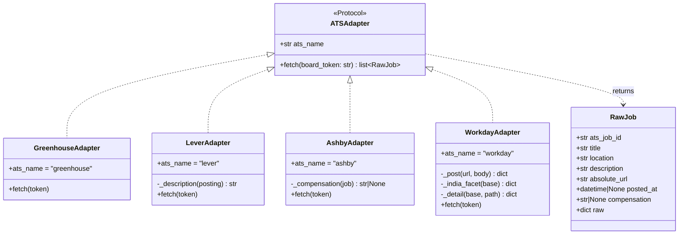
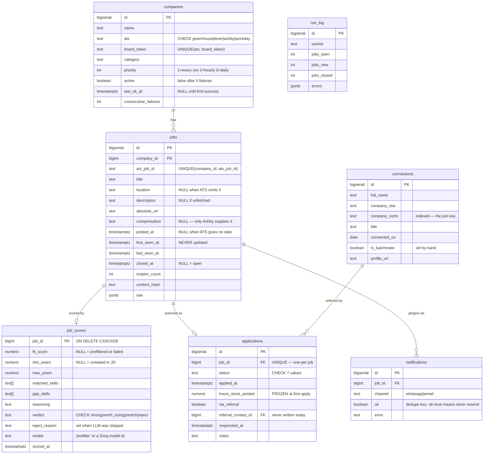
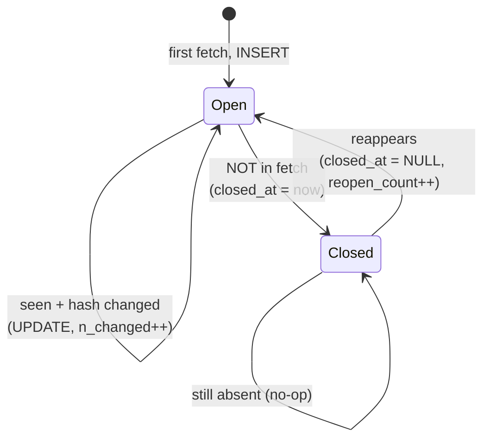
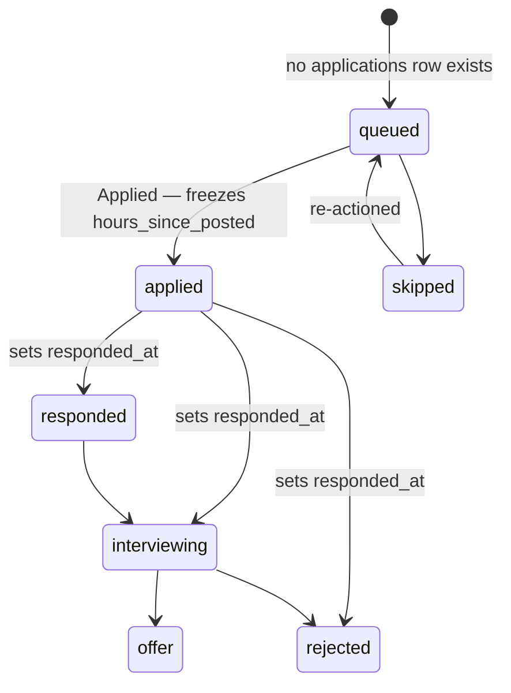
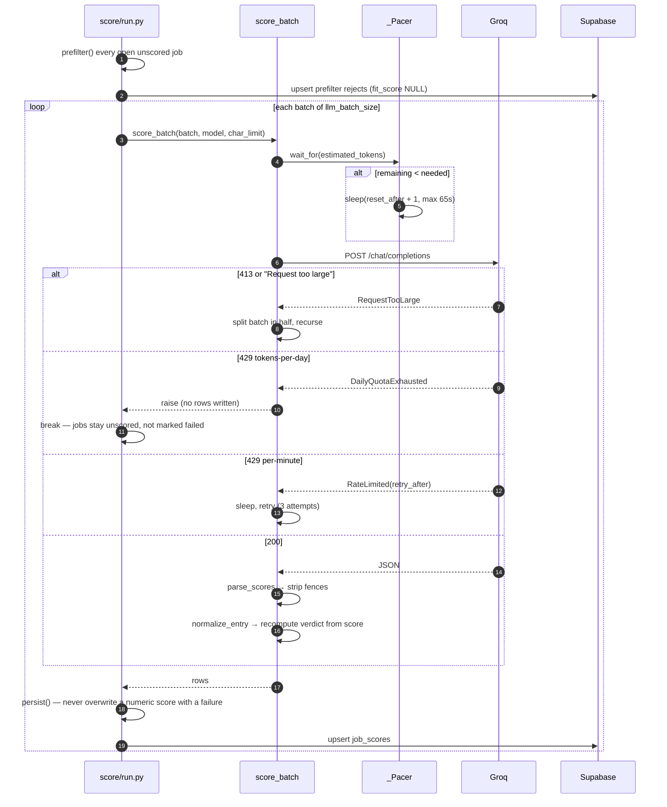
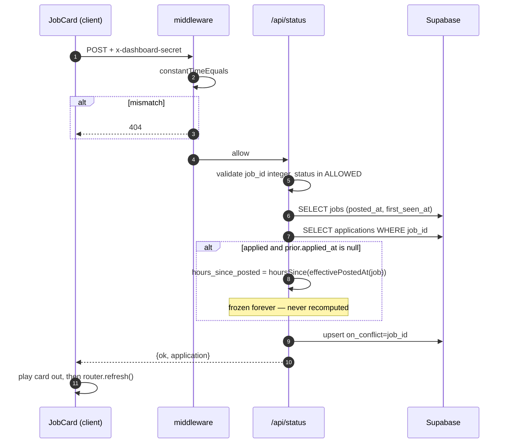
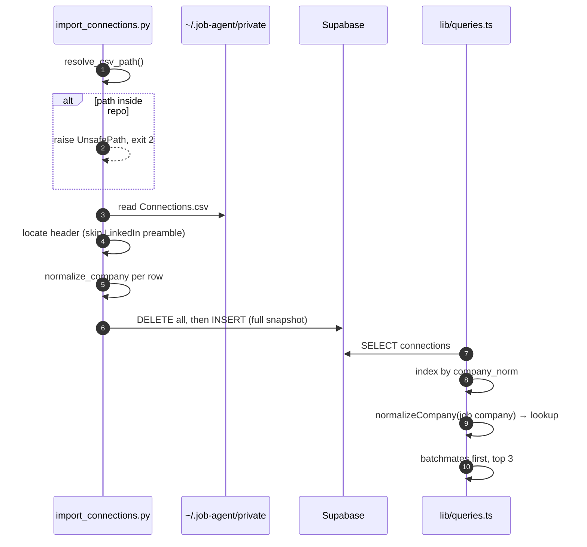

# Low-Level Design — Job Discovery & Referral Agent

Companion to [HLD.md](./HLD.md). Signatures below are copied from the code, not
paraphrased. Where the implementation is weak, it is called out inline and
collected in [§11](#11-known-limitations).

---

## 1. Module map

| Module | Key exports | Depends on |
|---|---|---|
| `ingest/models.py` | `RawJob`, `ATSAdapter`, `BoardFetchError` | — |
| `ingest/http.py` | `session()`, `get_json(url, timeout=20)` | `models` |
| `ingest/normalize.py` | `html_to_text`, `clean_text`, `content_hash`, `is_india_relevant`, `truncate_for_llm`, `parse_iso`, `parse_epoch_ms` | — |
| `ingest/lifecycle.py` | `Plan`, `plan(company_id, seen, existing)` | `models`, `normalize` |
| `ingest/store.py` | `Store`, `MissingCredentials` | — |
| `ingest/adapters/` | `get_adapter(ats)`, 4 adapters | `http`, `models`, `normalize` |
| `ingest/run.py` | `main()`, `is_due`, `fetch_board` | all of the above |
| `score/prefilter.py` | `prefilter`, `check_title`, `extract_experience`, `Prefiltered` | — |
| `score/llm.py` | `score_batch`, `build_system_prompt`, `parse_scores`, `normalize_entry`, `_Pacer`, 4 exception classes | `ingest.normalize` |
| `score/referral.py` | `normalize_company`, `match_company`, `rank_matches`, `Contact`, `Match` | `rapidfuzz` (optional) |
| `score/store.py` | `ScoreStore` | — |
| `score/run.py` | `main()`, `persist()` | all Layer 2 + `ingest.normalize` |
| `notify/whatsapp.py` | `format_message`, `send`, `configured` | — |
| `notify/email.py` | `transport()`, `send` | — |
| `dashboard/lib/db.ts` | `select`, `upsert`, `patch`, `effectivePostedAt`, `hoursSince`, `formatAge` | `server-only` |
| `dashboard/lib/queries.ts` | `getQueue`, `getQueueMeta`, `getJob`, `getFunnel`, `getCompanies` | `db.ts` |

---

## 2. The adapter protocol



### Per-adapter field mapping

| | Greenhouse | Lever | Ashby | Workday |
|---|---|---|---|---|
| Endpoint | `GET boards-api…/jobs?content=true` | `GET api.lever.co/v0/postings/{t}?mode=json` | `GET posting-api/job-board/{t}` | `POST wday/cxs/{tenant}/{site}/jobs` |
| Auth | none | none | none | none (browser UA required) |
| `ats_job_id` | `id` | `id` | `id` | `jobReqId` ‖ `bulletFields[0]` ‖ path tail |
| `title` | `title` | `text` | `title` | `title` |
| `posted_at` | `first_published` ‖ `updated_at` | `createdAt` (epoch ms) | `publishedAt` | `startDate` (detail call) |
| `description` | `content` (HTML-escaped) | assembled from 5 fields | `descriptionPlain` | `jobDescription` (detail call) |
| Compensation | — | — | `compensationTierSummary` | — |
| Requests/run | 1 | 1 | 1 | 1 + 1 per India posting |

Three details that are easy to get wrong:

- **Greenhouse uses `first_published`, not `updated_at`.** `updated_at` moves
  whenever anyone edits the req, which would fake the latency signal that
  `hours_since_posted` depends on (`adapters/greenhouse.py`).
- **Lever splits a JD across five fields.** `lists` holds the bulleted
  requirements — exactly where the years-of-experience line lives. Dropping it
  blinds the prefilter (`adapters/lever.py:_description`).
- **Lever's `country` is a real ISO code**, so `"IN"` can be expanded to
  `"India"` safely there — but never in the shared location regex, where
  `\bIN\b` under `re.I` would match the English word "in".

---

## 3. Schema



### Constraint rationale

| Object | Why |
|---|---|
| `UNIQUE(companies.ats, board_token)` | The natural key. Same token can legitimately exist on two ATS platforms (`ashby/redis` and a hypothetical `greenhouse/redis`). |
| `UNIQUE(jobs.company_id, ats_job_id)` | ATS ids are only unique *within* a board. This is the upsert conflict target. |
| `jobs_open_idx … WHERE closed_at IS NULL` | Partial index. Almost every query filters on open jobs; indexing closed rows wastes space that counts against the 500 MB tier. |
| `jobs_first_seen_idx DESC` | The queue orders by recency. |
| `connections_company_norm_idx` | The referral join key; the raw column is never joined on. |
| `applications.job_id UNIQUE` | One application record per job — makes the status write an upsert rather than an insert-or-update dance. |
| `job_scores.job_id` as PK | One score per job. Re-scoring overwrites rather than accumulating history. **Trade-off:** score history is lost; rejected because calibration drift is tracked via `scored_at` windows instead. |
| `ON DELETE CASCADE` on `job_scores` | A deleted job has no meaningful score. Deliberately *not* applied to `applications` — application history must survive. |

### Nullability that carries meaning

- `jobs.posted_at IS NULL` → the ATS gave no date; age falls back to
  `first_seen_at` (`effectivePostedAt` in `dashboard/lib/db.ts`) and the UI shows
  an "approx" marker.
- `job_scores.fit_score IS NULL` → never LLM-scored. Combined with
  `reject_reason` this distinguishes *prefiltered* from *transport failure*.
- `companies.last_ok_at IS NULL` → never successfully polled; `is_due` treats it
  as due immediately.

---

## 4. State machines

### 4.1 Job lifecycle (Layer 1)



Enforced entirely by `ingest/lifecycle.py:plan()`. The critical precondition:
**the fetch must be a whole board.** The `Open → Closed` edge is triggered by
absence, so diffing against a partial or filtered response would close jobs
that still exist.

### 4.2 Application status (Layer 2)



Enforced by `dashboard/app/api/status/route.ts` plus the `CHECK` constraint on
`applications.status`. Two rules live only in the route handler:

```ts
if (status === "applied" && !prior?.applied_at) {
  row.applied_at = now;
  row.hours_since_posted = Number(hoursSince(effectivePostedAt(job)).toFixed(2));
}
if ((RESPONDED.has(status) || status === "rejected") && !prior?.responded_at) {
  row.responded_at = now;
}
```

A **rejection counts as a response**. Excluding it would inflate the response
rate by dropping the negative cases.

**Gap:** the API accepts any transition in `ALLOWED`. `queued → offer` directly
is legal today. The diagram above is intent; the code enforces only the
value set, not the edges.

---

## 5. Algorithms

### 5.1 Content hashing

```python
# ingest/normalize.py
def content_hash(title: str, location: str, description: str) -> str:
    payload = f"{title.strip()}|{location.strip()}|{description.strip()}"
    return hashlib.sha256(payload.encode("utf-8")).hexdigest()
```

Pipe-delimited so that moving text across field boundaries changes the hash.
All three inputs pass through `html_to_text` or `clean_text` first, so a JD
whose only change is markup does not read as edited. `clean_text` exists
precisely because Ashby and Lever serve pre-rendered plain text that skips
`html_to_text` and would otherwise keep its non-breaking spaces, producing a
different hash for identical content.

### 5.2 Lifecycle diffing

```python
# ingest/lifecycle.py
for job in seen:
    seen_ids.add(job.ats_job_id)
    digest = content_hash(job.title, job.location, job.description)
    prior = existing.get(job.ats_job_id)
    if prior is None:
        result.upserts.append(_payload(company_id, job, digest, 0)); result.n_new += 1
        continue
    was_closed = prior.get("closed_at") is not None
    changed = prior.get("content_hash") != digest
    if was_closed or changed:
        bump = (prior.get("reopen_count") or 0) + (1 if was_closed else 0)
        result.upserts.append(_payload(company_id, job, digest, bump))
        ...
    else:
        result.touch_ids.append(prior["id"])

result.close_ids = [row["id"] for ats_job_id, row in existing.items()
                    if ats_job_id not in seen_ids and row.get("closed_at") is None]
```

`_payload` builds an **identical key set for every row** — PostgREST derives the
`ON CONFLICT DO UPDATE` column list from the request body, so a ragged batch
would silently update different columns for different rows. Pinned by
`tests/test_lifecycle.py:test_upsert_payloads_share_one_key_set`.

### 5.3 Experience-range parsing

The most-iterated code in the repo; two real bugs were found against live data.

```python
# score/prefilter.py — patterns
RANGE            = rf"{NUM}\s*\+?\s*(?:-|–|—|to)\s*{NUM}\s*{YEARS}"
RANGE_BOTH_UNITS = rf"{NUM}\s*{YEARS}\s*(?:-|–|—|to)\s*{NUM}\s*{YEARS}"
AT_LEAST         = rf"(?:minimum(?:\s+of)?|at\s+least|min\.?|over|more\s+than)\s+{NUM}\s*\+?\s*{YEARS}"
PLUS             = rf"{NUM}\s*\+\s*{YEARS}"
PLAIN            = rf"{NUM}\s*{YEARS}"
```

**Bug 1 — unit repeated on both ends.** A real Cisco title,
`"ASIC Design Verification Engineer - 5 years to 13Years"`, matched none of the
original patterns and read as *unstated*, so a 5–13 year role passed the gate.
Fixed by `RANGE_BOTH_UNITS`, which is tried **first** because it spans the widest
text and `consider()` keeps whichever pattern claims a span first.

**Bug 2 — body text overriding an explicit title.** Originally the lowest figure
anywhere won. For `"Thermal Engineer - 7 to 10 yrs"` whose body mentioned
"2 years" in passing, the gate read 2 and let it through. The fix makes the
title authoritative:

```python
title_min, title_max = extract_experience(title, require_context=False)
if title_min is not None:
    min_years, max_years = title_min, title_max
else:
    min_years, max_years = extract_experience(description)
```

`require_context=False` for titles because the body heuristic demands an
experience-ish word within ±70 characters — prose JDs have one, titles do not.
In body text the lowest figure still wins, deliberately: over-reading the
requirement would reject jobs the operator should apply to, which is the exact
failure this system exists to avoid.

Guards: figures above `MAX_PLAUSIBLE_YEARS = 15` are ignored, and
`NOT_A_REQUIREMENT` rejects windows containing `ago`, `history`, `founded`,
`revenue`, `grown`, etc. — because *"we have grown 10x in 3 years"* is not a
requirement.

### 5.4 Title gating

Order matters and is load-bearing (`check_title`):

1. `HARD_OFF_FUNCTION` — sales/support roles that satisfy the positive filter by
   accident. `"business development"` matches on *development*;
   `"Technical Support Engineer"` on *engineer*. Without this list the survivors
   were majority GTM roles.
2. `DOMAIN_OFF_FUNCTION` **and not** `STRONG_ENGINEERING` — `finance`, `marketing`
   etc. only disqualify a title with no engineering noun, so
   `"Analytics Engineer – Finance"` survives while
   `"AI Specialist, Treasury Finance Operations"` does not.
3. `MTS` — handled **before** the function and seniority checks. The bare title
   "Member of Technical Staff" contains no engineering noun to match and its
   "staff" would trip the seniority rule; the exemption strips only the phrase,
   so "Senior Member of Technical Staff" is still rejected on the remainder.
4. `TARGET_FUNCTION`, then `SENIOR_TITLE`.

Measured effect on live data: **474 India-relevant postings → 22 survivors (5%)**.

### 5.5 Company-name normalization

```python
# score/referral.py
def normalize_company(raw):
    # NFKD → strip accents → lowercase → drop parentheticals (if content remains)
    # → strip to [a-z0-9& ] → repeatedly apply NOISE until stable
```

The loop is required because noise nests: `"technologies india private limited"`
needs several passes. Matching is exact-first, fuzzy-fallback:

```python
exact = [Match(c, "exact", 100) for c in contacts if c.company_norm == target]
if exact: return exact
...
if ratio < FUZZY_THRESHOLD: continue          # 85
if target.split()[0] != contact.company_norm.split()[0]: continue
```

The leading-token guard exists because `token_set_ratio` treats a subset as a
perfect match — `"walmart"` scores 100 against `"walmart labs"`, but the same
generosity flatters unrelated short strings. **The expensive failure is a false
positive:** it sends the operator to message a stranger about a job at a company
they never worked for. Verified on real data — Atlantis≠Atlan, Whatfix≠Fi Money,
News Corp≠New Relic, WizzyBox≠Wiz all correctly rejected.

### 5.6 Groq pacing

Three distinct 429-ish conditions that look identical unless the body is read:

```python
if resp.status_code == 413: raise RequestTooLarge(...)
if resp.status_code == 429:
    if "Request too large" in body: raise RequestTooLarge(body)
    hint = _retry_hint_seconds(body)          # "try again in 33m40.032s"
    if "tokens per day" in body.lower(): raise DailyQuotaExhausted(hint, body)
    raise RateLimited(min(hint + 2.0, 90.0), body)
```

**This distinction was learned the hard way.** The first implementation read
`x-ratelimit-reset-tokens` — which reports the *per-minute* window and returned
`229ms` — while the actual failure was the *per-day* quota with a 33-minute
reset. It retried immediately and burned the remaining daily budget writing
failure rows over good scores. `tests/test_llm.py` pins every step of that chain.

`RequestTooLarge` recovery is recursive:

```python
if len(jobs) > 1:
    mid = len(jobs) // 2
    return score_batch(jobs[:mid], ...) + score_batch(jobs[mid:], ...)
if char_limit > 1200:
    return score_batch(jobs, char_limit=char_limit // 2, ...)
```

---

## 6. Sequence diagrams

### 6.1 Scoring batch with 413 backoff



### 6.2 Dashboard status write



### 6.3 Referral match



**Note the duplication:** `normalizeCompany` is reimplemented in TypeScript in
`dashboard/lib/queries.ts` alongside the Python original. They can drift. See
[§11](#11-known-limitations).

---

## 7. Error taxonomy

| Class | Raised in | Caught in | Retry | Persisted |
|---|---|---|---|---|
| `BoardFetchError` | `ingest/http.py`, `workday.py` | `ingest/run.py:fetch_board` | no | `run_log.errors`, `consecutive_failures++` |
| bare `Exception` (adapter bug) | any adapter | `fetch_board` | no | same, prefixed `adapter error:` |
| `MissingCredentials` | `ingest/store.py.__init__` | `ingest/run.py:main` | no | exit 2 |
| `RuntimeError` (PostgREST ≥300) | `Store._request` | `run.py` per-company | no | `run_log.errors` |
| `PermissionError` | `Store._path` | nothing — **crashes** | no | — (a boundary violation should be loud) |
| `RequestTooLarge` | `_call_groq` | `score_batch` | split/shrink | — |
| `RateLimited` | `_call_groq` | `score_batch` | 3× header-driven | — |
| `DailyQuotaExhausted` | `_call_groq` | `score/run.py:main` | no — stops run | nothing written |
| `ScoringError` | `parse_scores`, `_call_groq` | `score_batch` | 1 retry | `reject_reason=scoring_failed:…` |
| `UnsafePath` | `resolve_csv_path` | `import_connections:main` | no | exit 2 |
| `NotConfigured` | `notify/whatsapp.py`, `email.py` | `notify/run.py` | no | `notifications.ok=false` |

---

## 8. Invariants

| # | Invariant | Enforced by |
|---|---|---|
| 1 | `hours_since_posted` is frozen at first apply and never recomputed | `api/status/route.ts` guard `!prior?.applied_at`; verified live (698.93 held across a status change) |
| 2 | `first_seen_at` is never updated after insert | Absent from `_payload`; `tests/test_lifecycle.py:test_first_seen_at_never_written` |
| 3 | Compensation and notice period never pass through an LLM | `build_system_prompt` filters out `compensation`; asserted at build time |
| 4 | Layer 1 never references Layer 2 tables | `Store._path` at runtime + `check_boundaries.py` in CI |
| 5 | No banned job platform is contacted | `check_boundaries.py` URL scan across all source types |
| 6 | One successful ping per job, ever | `notify/run.py` filters on `notifications.ok=true` |
| 7 | A transport failure never overwrites a real score | `score/run.py:persist()` |
| 8 | Every upsert batch shares one key set | `_payload`; `test_upsert_payloads_share_one_key_set` |
| 9 | `verdict` is always consistent with `fit_score` | `normalize_entry` recomputes it, ignoring the model's own verdict |
| 10 | PII is never read from inside the repo | `resolve_csv_path`; `test_path_inside_the_repo_is_refused` |
| 11 | The service key never reaches the browser | `server-only` import; verified with a planted client import |

---

## 9. Configuration reference

### Environment variables

| Var | Type | Default | Blast radius if wrong |
|---|---|---|---|
| `SUPABASE_URL` | URL | — | Everything fails at startup |
| `SUPABASE_SERVICE_KEY` | JWT | — | Total DB compromise if leaked |
| `GROQ_API_KEY` | string | — | Scoring stops; ingestion unaffected |
| `DASHBOARD_SECRET` | 32-char hex | — | **Dashboard fully public if empty** — middleware returns 404 for all, so an empty value locks *you* out rather than opening it |
| `CONNECTIONS_CSV_PATH` | path | `~/.job-agent/private/**/Connections.csv` | Refuses to run if inside repo |
| `PING_THRESHOLD` (Vercel) | float | `6.5` | Too low floods the queue; too high hides jobs |
| `DASHBOARD_URL` | URL | `""` | Pings link to the raw ATS URL instead |
| `CALLMEBOT_PHONE` / `_APIKEY` | string | — | WhatsApp disabled; email fallback used |
| `RESEND_API_KEY` / `ALERT_EMAIL_TO` | string | — | No fallback channel at all |
| `SMTP_HOST/PORT/USER/PASS` | string | `smtp.gmail.com:587` | Alternative to Resend |

### `config/settings.yaml`

| Key | Default | Blast radius |
|---|---|---|
| `ping_threshold` | `6.5` | Queue inclusion cutoff |
| `poll_interval_minutes` | `15` | Documentation only — the cron in `ingest.yml` is authoritative |
| `llm_batch_size` | `3` | Too high → 413 and split-retries |
| `description_char_limit` | `2000` | Too high → 413; too low → the model can't see requirements |
| `max_experience_years` | `4` | The core hypothesis knob |
| `location_keywords` | list | **Currently unused** — `normalize.py` hardcodes its own regex |
| `fetch_concurrency` | `8` | Higher risks ATS blocking |
| `max_consecutive_failures` | `5` | Auto-deactivation threshold |

### `config/candidate_profile.yaml`

Single source of truth for résumé facts, calibration and compensation. The
`scoring_rules` block is injected **verbatim** into the prompt — it is the only
lever controlling score inflation, so calibration is tuned there, not in code.
The `compensation` block is stripped before the prompt is built and materialised
separately into `dashboard/lib/screening.generated.json` by
`scripts/sync_screening.py`.

---

## 10. Extension guide — adding a fifth ATS

Worked example: SmartRecruiters, whose public API is already confirmed
(`GET https://api.smartrecruiters.com/v1/companies/{id}/postings?limit=100`).

1. **Probe manually first.** Confirm the endpoint is unauthenticated and check
   what a *nonsense* id returns — the whole Workday discovery failed initially
   because 404 and 422 mean the opposite of what they appear to.
2. **Add the adapter** `ingest/adapters/smartrecruiters.py` with
   `ats_name = "smartrecruiters"` and `fetch(board_token) -> list[RawJob]`.
   Use `ingest.http.get_json`; raise `BoardFetchError` on any non-200.
   Descriptions must go through `html_to_text` or `clean_text`.
3. **Register it** in `ingest/adapters/__init__.py:ADAPTERS`.
4. **Relax the DB check constraint:**
   ```sql
   ALTER TABLE companies DROP CONSTRAINT companies_ats_check;
   ALTER TABLE companies ADD CONSTRAINT companies_ats_check
     CHECK (ats IN ('greenhouse','lever','ashby','workday','smartrecruiters'));
   ```
5. **Teach the verifier.** Add the endpoint to `ENDPOINTS` in
   `scripts/verify_boards.py` and a branch in `extract()` returning
   `[(title, location)]`. Compound tokens need their own `probe_*` like Workday's.
6. **Print identity, not just liveness.** Every hit must show company name plus a
   sample title and location. A live board is not proof it is the right company —
   probing "Pine Labs" found a Canadian mortgage brokerage, and "Fractal" a US
   venture studio. Both looked like clean hits on job count alone.
7. **Seed and verify:** add to a `seeds/*.yaml`, run
   `verify_boards.py --seeds … --write-db`.
8. **Run `scripts/check_boundaries.py`** — a new adapter must not import Layer 2.
9. **Add a paging test** if the API paginates; note requests-per-run in the table
   in [§2](#2-the-adapter-protocol).

---

## 11. Known limitations

1. **`normalizeCompany` is duplicated** in `dashboard/lib/queries.ts` (TypeScript)
   and `score/referral.py` (Python), with no shared fixture pinning them
   together. They will drift, and the dashboard will show different referral
   matches than the notifier would.
2. **The dashboard's referral matcher has no fuzzy fallback** — it is exact-match
   only on `company_norm`, whereas Python has a guarded `token_set_ratio` path.
3. **Status transitions are unconstrained** beyond the `CHECK` value set; the
   state machine in [§4.2](#42-application-status-layer-2) is intent, not enforcement.
4. **`settings.yaml:location_keywords` is dead configuration** — `normalize.py`
   hardcodes its own `INDIA`/`REMOTE` regexes. Editing the YAML does nothing.
5. **`poll_interval_minutes` is also inert.** The real schedule is the cron
   expression in `ingest.yml`; the two can silently disagree.
6. **No pagination guard on `getQueue`** — it loads all open jobs and all scores
   into serverless memory on every request.
7. **`applications.referral_contact_id` is never written.** `via_referral` is a
   boolean with no link to *which* contact.
8. **Workday's `ats_job_id` fallback chain is fragile.** If `jobReqId` is absent
   it falls back to `bulletFields[0]` and then the URL path tail; a tenant
   changing its URL shape would orphan every stored row for that board and
   present them as new.
9. **`_pacer` is module-global mutable state.** Fine single-threaded; wrong if
   scoring is ever parallelised.
10. **No test covers `ingest/store.py` or `score/store.py`** — every PostgREST
    interaction is exercised only through live runs.
